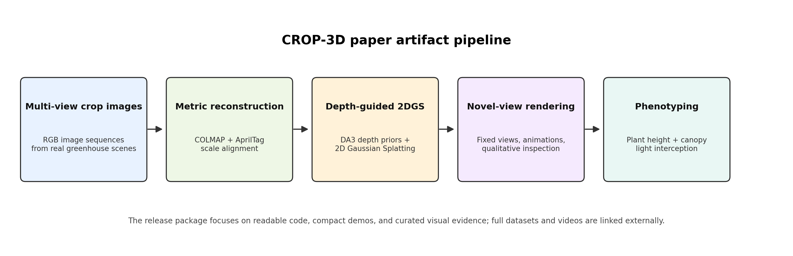
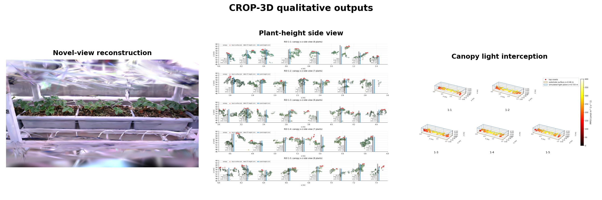

# CROP-3D

**CROP-3D** is a paper artifact for real-scene crop reconstruction and phenotyping. It packages a compact, readable version of the research workflow around multi-view COLMAP/2D Gaussian Splatting reconstruction, metric alignment, plant-height measurement, and canopy light-interception estimation.

<div align="center">
  
</div>



## What This Repository Contains

This repository is designed as a **paper project page + reproducible demo package**, not a full raw-data release. It focuses on code structure, small examples, and curated visual outputs. Components follow the full pipeline order: **2DGS reconstruction → plant-height phenotyping → canopy light interception**.

| Component | Path | Status |
| --- | --- | --- |
| **2DGS reconstruction** | | |
| One-command reconstruction entry | `quick_start.py` | Included |
| 2DGS training / render / metrics | `crop3d/reconstruction/twodgs/` | Included |
| COLMAP, AprilTag alignment, DA3 depth priors | `crop3d/reconstruction/` | Included |
| 2DGS rasterization extensions | `crop3d/reconstruction/submodules/` | Included |
| Reconstruction smoke-test images | `examples/reconstruction_demo/images/` | Included |
| Fixed-view visualization | `crop3d/visualization/`, `media/reconstruction_fixed_view.png` | Included |
| **Plant-height phenotyping** | | |
| Height measurement code | `crop3d/phenotyping/plant_height/` | Included |
| Demo runner | `scripts/run_plant_height_demo.py` | Included |
| Demo point cloud and GT | `examples/plant_height_demo/input/` | Included |
| Reference metrics and figures | `examples/plant_height_demo/reference_output/` | Included |
| Regenerated demo outputs | `outputs/plant_height/` | Generated on run |
| **Canopy light interception** | | |
| Interception and ROI code | `crop3d/phenotyping/light_interception/` | Included |
| Demo runner | `scripts/run_light_interception_demo.py` | Included |
| PPFD light-field model and ROI inputs | `examples/light_interception_demo/input/` | Included |
| Five-region comparison assets | `examples/light_interception_demo/five_regions/` | Included |
| Reference interception summary | `examples/light_interception_demo/reference_output/` | Included |
| Regenerated demo outputs | `outputs/light_interception/` | Generated on run |
| **External / not in Git** | | |
| Full raw image/video dataset | — | External / available upon request |
| Full trained reconstruction outputs | — | External / available upon request |
| Large checkpoints and HD videos | `checkpoints/`, see `docs/model_weights.md` | External release planned |

## Highlights



- Multi-camera real-scene **2DGS reconstruction** with COLMAP, physical scale alignment, DA3 depth priors, and 2D Gaussian Splatting (`crop3d/reconstruction/`).
- **Plant-height** measurement from reconstructed point clouds using adaptive canopy segmentation and fixed metric ground reference (`crop3d/phenotyping/plant_height/`).
- **Canopy light-interception** estimation using a measured PPFD light-field model and oriented disk surface completion (`crop3d/phenotyping/light_interception/`).

## Quick Start

Create an environment:

```bash
conda env create -f environment.yml
conda activate crop3d-paper
pip install -e .
pip install crop3d/reconstruction/submodules/diff-surfel-rasterization
pip install crop3d/reconstruction/submodules/simple-knn
```

Inspect the reconstruction pipeline plan:

```bash
python quick_start.py \
  --input-images examples/reconstruction_demo/images \
  --scene work_dirs/reconstruction_demo_scene \
  --run-name demo_reconstruction \
  --dry-run \
  --skip-train
```

The `examples/reconstruction_demo/images` directory follows the required
`images/<camera_name>/` layout and can be used for a small smoke test. Larger
full-scene reconstruction runs require real multi-camera images in the same
layout plus external tools such as COLMAP, CUDA PyTorch, DA3 weights, and the
2DGS rasterization extensions.

`quick_start.py` copies images into `scene/images/<camera_name>/` by default.
Do not use symlinked images for COLMAP runs because COLMAP may resolve the real
path and break `single_camera_per_folder` camera grouping.

Run a short smoke test:

```bash
python quick_start.py \
  --input-images examples/reconstruction_demo/images \
  --scene work_dirs/reconstruction_demo_scene \
  --run-name smoke_reconstruction \
  --iterations 10 \
  --resolution 4 \
  --lambda-depth 0 \
  --no-eval \
  --test-iterations 10 \
  --save-iterations 10
```

With real images and dependencies installed, run:

```bash
python quick_start.py \
  --input-images path/to/scene/images \
  --scene work_dirs/reconstruction_demo_scene \
  --run-name demo_reconstruction \
  --iterations 30000 \
  --resolution 2
```

Use `--dry-run` first to inspect the planned steps without launching COLMAP or training:

```bash
python quick_start.py \
  --input-images path/to/scene/images \
  --scene work_dirs/reconstruction_demo_scene \
  --dry-run
```

The packaged 2DGS training entry is `crop3d/reconstruction/twodgs/train.py`; `quick_start.py` calls it after COLMAP, optional AprilTag alignment, optional DA3 depth-prior generation, and a PINHOLE camera conversion step for the 2DGS loader.

AprilTag alignment and DA3 depth priors are off by default for smoke tests.
Enable them with `--with-apriltag` and `--with-da3` when the scene contains
AprilTags and the DA3 weights/environment are available.

Run the downstream compact demos:

```bash
python scripts/run_plant_height_demo.py
python scripts/run_light_interception_demo.py
```

Outputs are written under:

```text
outputs/plant_height/
outputs/light_interception/
```

More details are in [docs/quick_start.md](docs/quick_start.md).

## Repository Layout

```text
CROP-3D/
├── quick_start.py
├── crop3d/
│   ├── reconstruction/
│   │   ├── run_colmap_demo.py
│   │   ├── align_colmap_apriltag_demo.py
│   │   ├── prepare_da3_depth_demo.py
│   │   ├── convert_colmap_cameras_to_pinhole.py
│   │   ├── twodgs/
│   │   │   ├── train.py
│   │   │   ├── train_config.py
│   │   │   ├── render.py
│   │   │   ├── metrics.py
│   │   │   ├── arguments/
│   │   │   ├── gaussian_renderer/
│   │   │   ├── scene/
│   │   │   └── utils/
│   │   └── submodules/
│   ├── phenotyping/
│   └── visualization/
├── scripts/
├── examples/
│   ├── plant_height_demo/
│   └── light_interception_demo/
├── media/
├── docs/
├── data/
└── checkpoints/
```

The full dataset and large model outputs are intentionally not stored in Git. See [docs/dataset.md](docs/dataset.md) and [docs/model_weights.md](docs/model_weights.md).

## Reproduction Scope

The included demos reproduce the curated paper-artifact outputs from compact point-cloud and summary assets. Full end-to-end reconstruction from raw videos/images requires external data and heavier dependencies such as COLMAP, CUDA-enabled PyTorch, and the original 2DGS rasterization extensions.

See [docs/reproduction.md](docs/reproduction.md) for the exact boundary.

## Citation

If you use this artifact, please cite the accompanying paper. The citation metadata is provided in [CITATION.cff](CITATION.cff) and should be updated with the final paper information before public release.

## License

The license is currently a placeholder. Before public upload, replace [LICENSE](LICENSE) with the final license and verify compatibility for all third-party components.
